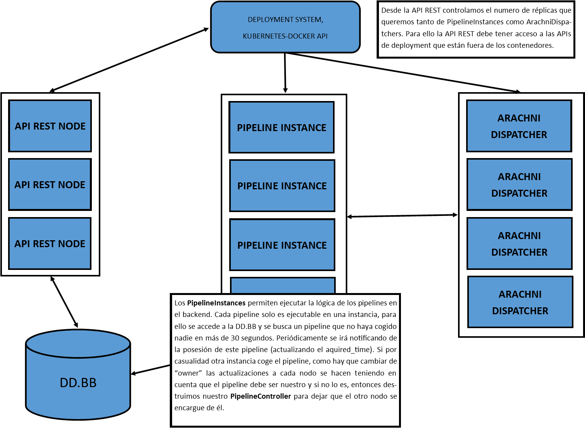

# WebWard

Continuous Security Platform.

### Installation

Use it as part of a Kubernetes cluster, as a simple docker container (partiall support) or as baremetal deployment.

[Installation for CentOS 7](https://github.com/SecSamDev/WebWardRest/blob/master/bare-metal-installation.md)
#### Requirements

It required a secret to access the DockerHub for webward and the secret must be called "webward-secret". The image of the container by default is secsamdev/webward.

[secsamdev/webward](https://hub.docker.com/r/secsamdev/webward/)
```
kubectl create secret docker-registry webward-secret --docker-server="docker.io/secsamdev" --docker-username="" --docker-password="" --docker-email=""
```

It needs access to a postgreSQL database. This information should be passed as ENVIRONMENT variables like:
```
PGUSER webward
PGHOST localhos
PGDATABASE webward
PGPASSWORD webward
PGPORT 5432
```

And install this extensions in postgresql (needs to be superuser).If the webward user alredy is a superuser, then this step is not needed.

```
CREATE EXTENSION IF NOT EXISTS "pgcrypto";
CREATE EXTENSION IF NOT EXISTS "uuid-ossp";
```

Also it is a good idea to put the platform in an isolated namespace if using kubernetes.
If the platform is going to be executed using docker, then update the iptables to allow accessing the docker API.

```
iptables -A FORWARD -i docker0 -o eth0 -j ACCEPT
iptables -A FORWARD -i eth0 -o docker0 -j ACCEPT
iptables -A FORWARD -i eth0 -o docker0 -m state --state RELATED,ESTABLISHED -j ACCEPT 
iptables -I INPUT -p tcp -m state --state NEW --dport 5432 -j ACCEPT
/sbin/sysctl -w net.ipv4.conf.all.forwarding=1
```

The generated infraestructure is like:



We as sysadmins only need to launch a single WebWard container and some virtualization resources for allow access to deployment APIs (Docker or Kubernetes). The rest of the infrastructure will be deployed by WebWard. But if we want the system to work with an alredy deployed BB.DD then we may pass the connection information to the platform.

#### Kubernetes Service Configuration

The Kubernetes Authentication credentials are stored on:

```
/var/run/secrets/kubernetes.io/serviceaccount/token
/var/run/secrets/kubernetes.io/serviceaccount/ca.crt
/var/run/secrets/kubernetes.io/serviceaccount/namespace
```

### Project Directories

- **arachni_rpc** : Ruby scripts for communication using RPC with Arachni Grid (Web Security Scanner).

- **bin** : Execution scripts

- **controllers** : Contiene los controladores de rutas de la API REST. Los controladores manejan toda la lógica de cada uno de los endpoints de la API, para simplificar la programación, hay cuatro controladores por cada ruta, uno por cada uno de los roles de usuario existentes.

- **db**: Script de comunicación e inicialización de la base de datos.

- **kube**: Almacena todos los scripts de despliegue de la infraestructura, los Dockerfiles de los contenedores así como los ficheros YAML de despliegue en kubernetes.

- **modules** : Modulos de Web Ward. En este directorio se almacenan todos los scripts necesarios para recoger un **pipeline** libre de la base de datos, todos sus nodos y ejecutar la lógica de cada nodo. Cada nodo implementa su lógica a traves de un módulo identificado por la propiedad *TAG*.

- **public** : Ficheros publicos que deberán ser servidor por un Servidor Web. Vease nginx o Apache.

- **routes** : La lógica de las rutas HTTP. Esta es delegada a su vez a los controladores.

- **test** : Ficheros para realizar pruebas.

- **views** : Solo contiene el fichero HTML original que carga todo el Frontend con ANGULAR.

- **ww_libraries** : Librerias que pueden ser usadas por módulos. Estas librerias están preparadas para ser seguras y a prueba de errores. Algunos ejemplos de librerias: ArachniRPC, Deployer,TelegramBot... Estas librerias exportan un "wrapper" que le simplifica la funcionalidad a los scripts de los modulos.


### Variables de Entorno importantes

Para el contenedor principal que ejecuta el servidor REST y la funcionalidad en backend de los pipelines tenemos:

- **EXECUTION_MODE**: Permite cambiar el modo de ejecución del contenedor pudiendo elegir entre solo API REST, solo Cluster de Pipelines o un modo mixto. Los valores admitidos son: REST, REST_PIPER y PIPER. Por defecto se aplica el modo REST_PIPER (ambos).


- **PGUSER**: Usuario de acceso a la base de datos PostgreSQL. Por defecto: *webward*


- **PGHOST**: Direccion IP o URL de la base de datos PostgreSQL. Por defecto: *localhost*


- **PGDATABASE**: Usuario de acceso a la base de datos PostgreSQL. Por defecto: *webward*


- **PGPASSWORD**: Contraseña de acceso a la base de datos PostgreSQL. Por defecto: *webward*


- **PGPORT**: Puerto de acceso a la base de datos PostgreSQL. Por defecto: *5432*

- **EXPECT_CT_URL**: Direccion URL la que queremos informar si no recibimos un CT valido.El endpoint de webward para ello es *'/report-ct'* pero se puede asignar uno externo. Si no se especifica **NO** se usara la cabecera "Expect-CT"

- **EXPECT_CT_AGE**: Maximo tiempo por el que se guardara el certificado para el sitio. Debe especificarse una EXPECT_CT_URL.  Por defecto: *30* segundos

El contenedor que funciona como nodo para crear el Grid de Arachni necesita también acceso a la base de datos PostgreSQL. Podemos pasarle los parametros por variables de entorno:

- **POSTGRES_USERNAME**: Usuario de acceso a la base de datos PostgreSQL. Por defecto: *webward*


- **POSTGRES_HOST**: Direccion IP o URL de la base de datos PostgreSQL. Por defecto: *localhost*


- **POSTGRES_DATABASE**: Usuario de acceso a la base de datos PostgreSQL. Por defecto: *webward*


- **POSTGRES_PASSWORD**: Contraseña de acceso a la base de datos PostgreSQL. Por defecto: *webward*

Este contenedor permite ser accedido por el puerto 22 (SSH) por defecto, además tiene abiertos los puertos 7331 y 9292 que son los que utiliza arachni para su funcionamiento. 

Hay además una variable de entorno importante que debe ser pasada que es **RPCD_NEIGHBOUR** para poder conectarse a otros nodos del grid. Este es el codigo que se ejecuta por defecto al arrancar:

```
# set-e allow us to kill the container if arachni or sshd fails
set -e
if [[ -z "${RPCD_NEIGHBOUR}" ]];
then 
    # Execute in parallel
    #First arachni witouth neighbour
    arachni_rpcd --nickname=${HOSTNAME} --address=${RPCD_ADDRESS}  &
    #Then SSH as a process not a daemon
    /usr/sbin/sshd -D
else
    arachni_rpcd --nickname=${HOSTNAME} --address=${RPCD_ADDRESS} --neighbour=${RPCD_NEIGHBOUR} &
    #Then SSH as a process not a daemon
    /usr/sbin/sshd -D
fi
```

### Bootstrapping

En el proceso de arranque se sigue una serie de pasos:

1. Se comprueba el entorno en el que se está ejecutando el sistema:
    1. Primero la plataforma (linux o win32)
    2. Kubernetes, Docker o Bare-Metal
    3. En el caso de ser Bare-Metal comprueba si tiene acceso a Minikube, a la API de Kubernetes o a la API de Docker.
2. Comprueba si tenemos acceso a la BB.DD
    1. En caso de no tenerlo si tenemos acceso a una API de deploy buscamos si existe ya alguna (ww-postgres) o lanzamos una BB.DD.
3. Ahora comprobamos el tipo de ejecución y lanzamos la API REST, el *Pipeliner* o ambos.