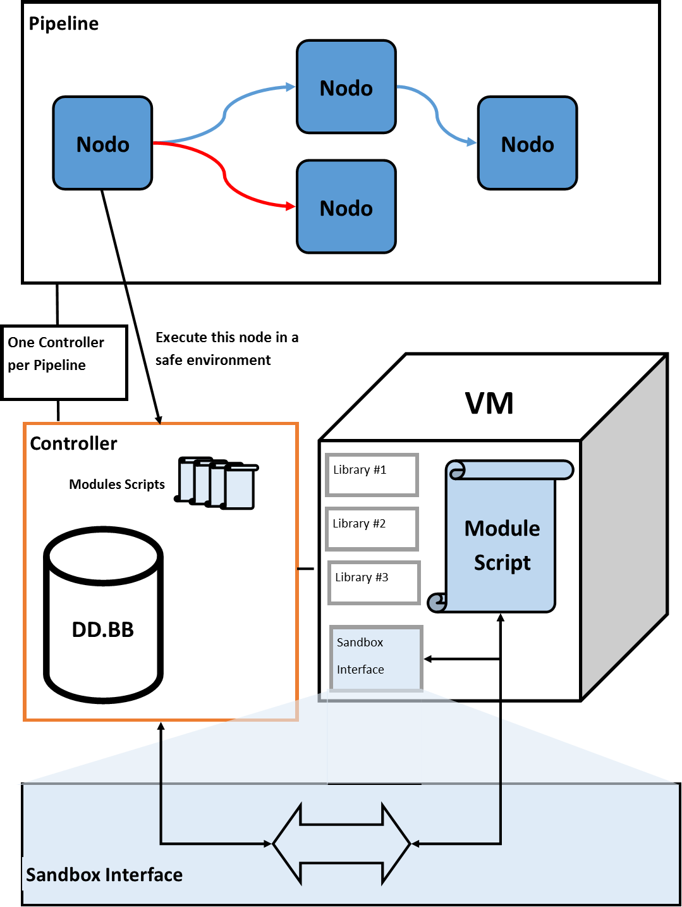

# Module System for WebWard

* **safeNodeSandbox**: Permite crear sandbox especificos para el modulo, de forma que no acceda a recursos que no le corresponden. Se encarga de cargar solo las librerias que necesita el módulo.

* **pipelineJobQueue**: Periodicamente busca Pipelines que no son propiedad de ningún cluster e inicia su ciclo de vida. Se encarga de obtener todos los nodos asignados al pipeline, asignarle modulos a cada nodo y lanzar el controlador del pipeline.

* **pipeline**: contiene las clases para trabajar con Pipelines, PipelineNodes y NodeConectors.

* **loader**: permite cargar modulos en la libreria, tanto modulos que existen en un directorio como de un archivo zip obtenido de una URL.

* **module_library**: Almacén donde se guardan los modulos.

* **ww_module**: Es un módulo. Cada nodo implementa su lógica de funcionamiento a través de un módulo. La clase WebWardModule implementa tanto la lista de librerias que necesita, los scripts preinterpretados (javascript) así como informacion sobre la procedencia (origen) del módulo para, en un futuro, poder saber de donde lo obtuvimos y controlar las versiones de los módulos.

* **service**: Wraper para almacenar servicios en un controller. Estos servicios son por ejemplo conexiones u objetos grandes que cuesta mucho "crearlos" y es necesario mantenerlos vivos en cada ciclo.

* **PipeLifecycleController**: Es un controlador para el pipeline. Se encarga de ejecutar los diferentes nodos usando sus scripts de modulo (WWModules), actualizarlos en la base de datos, recoger posibles cambios desde la base de datos etc. Los nodos pueden comunicarse con el controlador pero para ello necesitan usar una "interfaz segura" (sandbox interface) que enlaza el controlador con el script que se ejecuta en la VM.

## Cargar modulos

La interfaz web permite cargar módulos dinamicamente, no obstante si se quiere tener ya módulos precargados es posible copiarlos en la carpeta: 'modules/WW_MODULES' pudiendo montarla directamente en el contenedor y así evitar el tráfico de red para descargar los módulos.

## Como funcionan los nodos

Primero que nada hay una serie de nodos que son los únicos en los que se comprueba su estado en la BB.DD, ya que pueden ser iniciados por causas externas al Pipeline (Nodos START).

El anterior Webhook permite ser activado el pipeline haciendo una llamada a una URL.

Los nodos almacenan una serie de variables, algunas de las cuales modifican el comportamiento del nodo.

- **_SHOW** : (ARRAY) Esta variable controla que variables se muestran en el nodo. En el anterior nodo solo se muestra la variable _WEBHOOK (nickname=webhook). Esta variable es un ARRAY de strings de la forma: _WEBHOOK,""...
- **_FORCES_END** : (BOOLEAN) un nodo activado con esta variable en true hace que todo el pipeline acabe (todos los nodos a END).

- **_FORCES_RESTART** : (BOOLEAN) Al activarse el nodo fuerza el reinicio del Pipeline y la cancelación del resto de nodos.

- **_UNTIL_END** : (BOOLEAN) Este nodo no puede activarse si esta ya activo. Debe esperar a que se apague para volver a activarse.

- **_RECALL** : (BOOLEAN) Este nodo puede ser reactivado sin hacer una limpieza de variables.

Todas las variables que empiezan por "_" (barra baja) permiten guardar el estado de la variable y no ser limpiadas nunca. El resto de variables al hacer una limpieza o cambiar el estado de todo el pipeline a INACTIVE son eliminadas del nodo.

Por ejemplo el SCHEDULER permite visualizar varias variables:

### Sistema de Tipos
Los nodos almacenan variables y se las pasan entre ellos. Estas variables tienen diferentes propiedades y hay de distintos tipos:

- **name** : Nombre de la variable. Si su nombre empieza por "_" no se puede limpiar la variable.
- **type** : Tipo de variable que puede ser de tipo NUMBER, ARRAY, JSON_ARRAY, DAYS_PICKER...
- **optional** : un booleano para indicar si es opcional o no.
- **value** : Valor guardado como string. En función del tipo este valor se va casteando.

Lista de tipos soportados:

- **NUMBER** : Numeros enteros y reales.
- **ARRAY** : Array de strings separados por comas y sin espacios. Ej: asdasda,asdadassd,adada. El nodo veria: ["asdasda", "asdadassd", "adada"]
- **DAYS_PICKER**: Un array de 7 booleanos, uno para cada dia de la semana. Se almacenan como: true,true,false,false... El nodo veria: [true, true, false, false...]
- **TIME**: Permite guardar horas. Ej: 12:35. El nodo veria: [12,35]
- **PORT**: Puertos validos desde el 0 hasta el 65555.
- **IP**: String con la IP. Ej: '127.0.0.1'
- **OBJECT**: Un objeto JSON como tal almacenado en forma de string. El nodo veria el objeto: {"prop1" : "val1", "prop2" : "val2"}
- **URL**: castea usando new URL("")
- **MESSAGE**: almacena un mensaje. Esto en los nodos visuales permite desplegar un mensaje. Se almacena como un string JSON que contiene solo dos atributos: "name" el nombre; y "msg" el contenido del mensaje.

